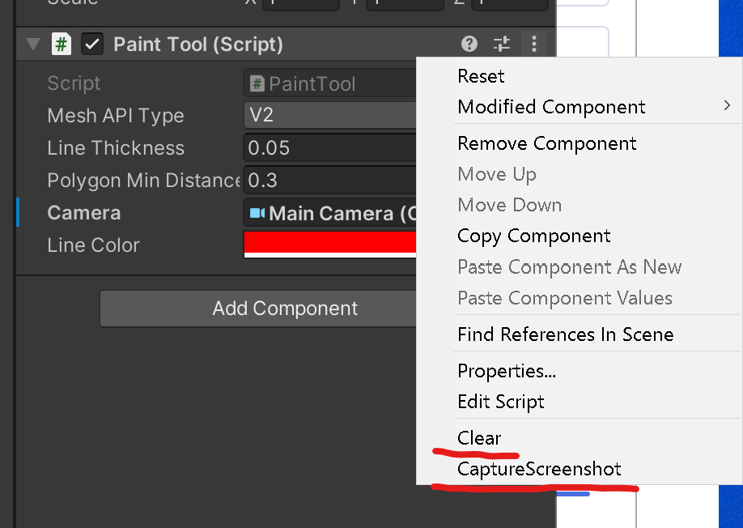
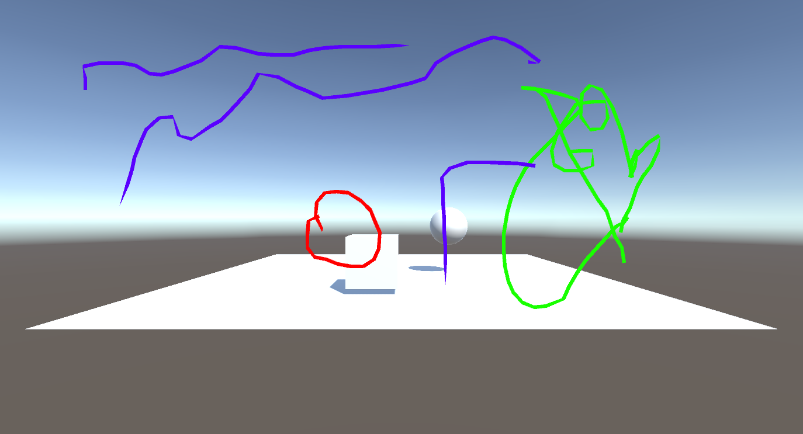

# UnityEditorPaintTool
Paint tool during the development. It works only in the Unity editor.
<br>

<b>Setup</b>:
<br>
Just add the ```PaintTool``` prefab in your scene hierarchy, and it has the PaintToll.cs in that prefab and gives the camera reference that you'd like to draw.

<br>
<b>In the context menu of the prefab:</b><br>
・Press clear<br>
You can clear the all-drawn lines.<br>
<br>
・Press CaptureScreenshot<br>
You can capture the Game View.<br>

<br>

<br>
<br>
The line mesh always will be top of any meshes.<br>
As for the default, this tool will use the Mesh API2, but if your unity editor is not compatible with the Mesh API2, you can also use the default Mesh API.
<br>
<br>

